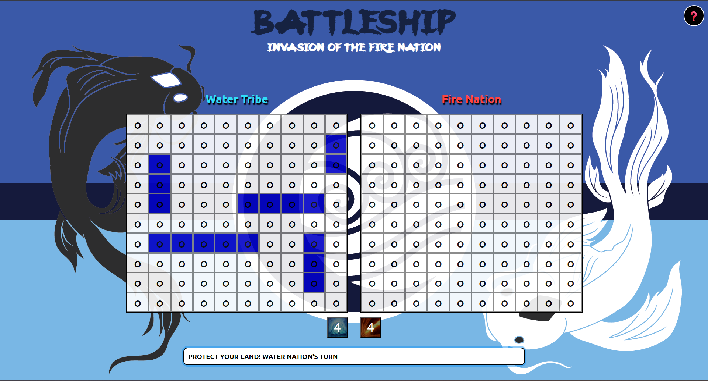
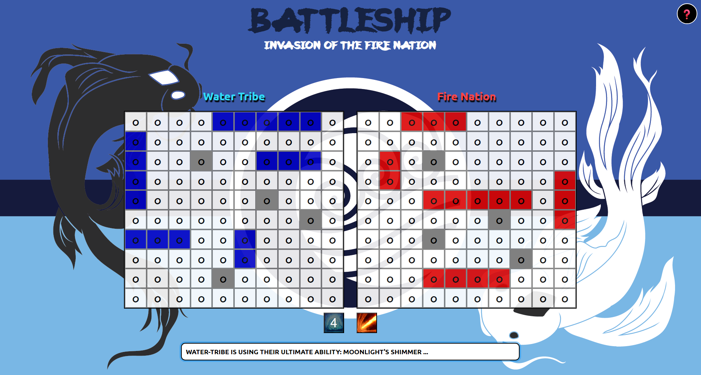
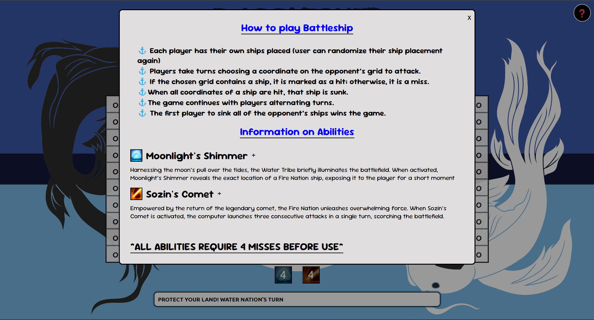

# Battleship: Avatar Edition
A battlehip game application inspired by Avatar the Last Airbender built with HTML, CSS, vanilla JS, and incoporates Test Driven Development (TDD) with Jest 

## Features
* Battleship Clone - Simulates similar gameplay to the  Battleship game
* Abilities - Grants the players abilities based on their element
    * Water Tribe: Moonlight's Shimmer
    * Fire Nation: Sozin's Comet
* Directions/Help - provides an area where a user can learn the game and abilities
* Responsive Design - Works on varying device layouts

[Live App](https://andykhandy.github.io/battleship/)

## Pictures 

## Future ideas to implement
* Add an animation to the abiliites
* Implement more abilities to cause even more chaos and unpredictability.